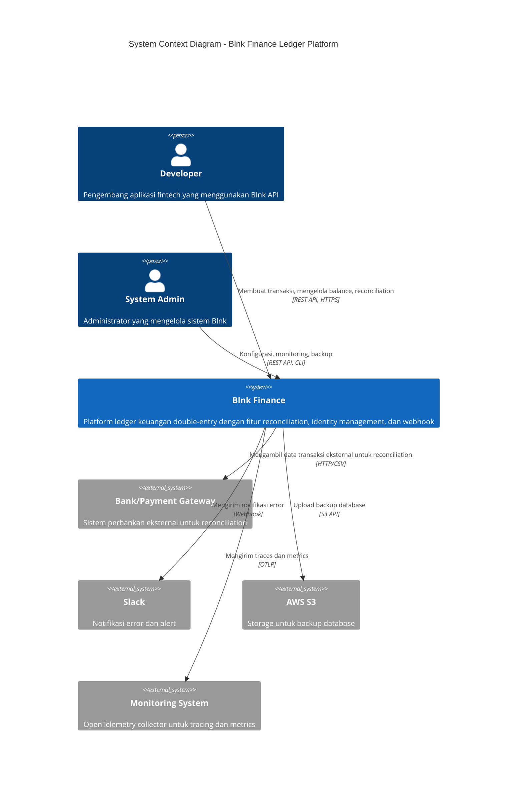
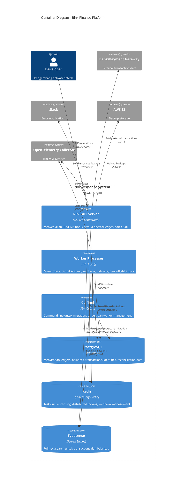
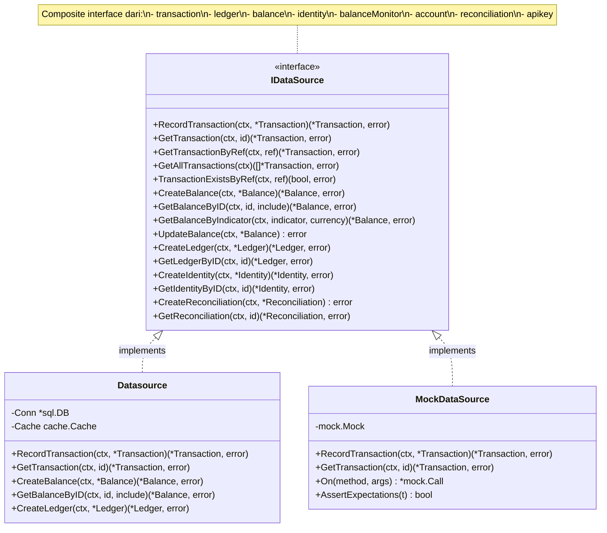
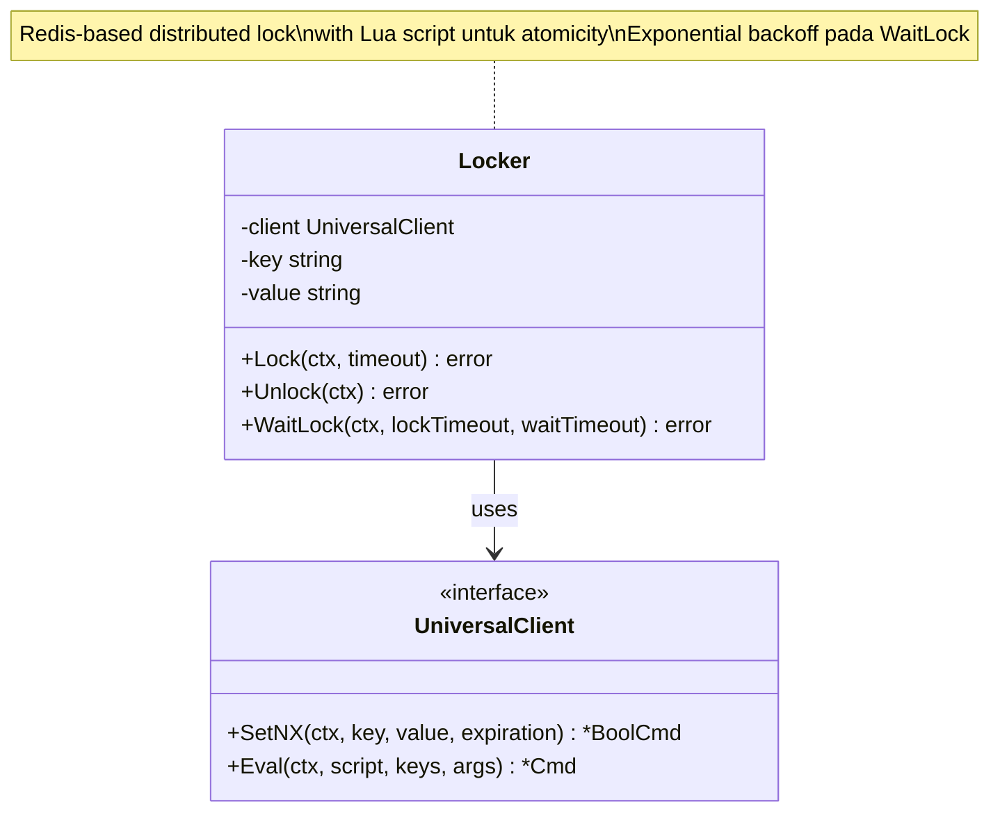
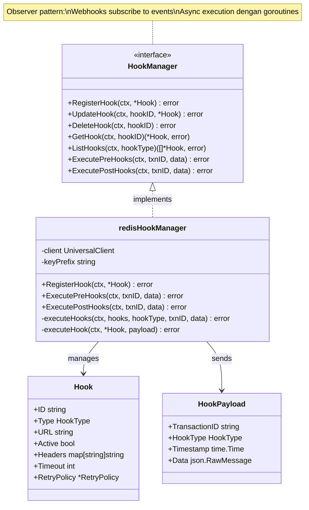
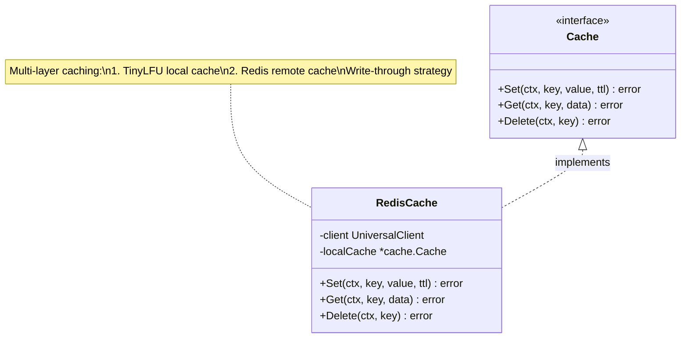

# Arsitektur Blnk Finance - C4 Model

## Daftar Isi
- [Level 1: Context Diagram](#level-1-context-diagram)
- [Level 2: Container Diagram](#level-2-container-diagram)
- [Level 3: Component Diagram](#level-3-component-diagram)
- [Level 4: Code Diagram](#level-4-code-diagram)

---

## Level 1: Context Diagram

Context diagram menunjukkan bagaimana sistem Blnk Finance berinteraksi dengan pengguna dan sistem eksternal.



### Deskripsi

**Blnk Finance** adalah platform ledger keuangan yang menyediakan:
- **Double-Entry Ledger**: Sistem pembukuan ganda untuk tracking transaksi
- **Balance Management**: Manajemen saldo dengan precision tinggi menggunakan big.Int
- **Reconciliation Engine**: Matching otomatis antara transaksi internal dan eksternal
- **Identity Management**: Tokenization PII (Personally Identifiable Information)
- **Webhook System**: Notifikasi event-driven untuk integrasi aplikasi
- **Search Engine**: Full-text search menggunakan Typesense

**Pengguna Utama:**
- **Developer**: Mengintegrasikan Blnk ke aplikasi fintech mereka
- **System Admin**: Mengelola konfigurasi, monitoring, dan maintenance

**Sistem Eksternal:**
- **Bank/Payment Gateway**: Sumber data untuk reconciliation
- **Slack**: Channel untuk error notifications
- **AWS S3**: Backup storage
- **Monitoring System**: OpenTelemetry untuk observability

---

## Level 2: Container Diagram

Container diagram menunjukkan aplikasi dan data store yang membentuk sistem Blnk.



### Deskripsi Container

#### 1. **REST API Server** (Port 5001)
- **Technology**: Go 1.25, Gin Web Framework
- **Responsibility**:
  - Menerima HTTP requests dari client
  - Authentication dan authorization via API keys
  - Rate limiting
  - Request validation
  - Routing ke business logic layer
- **Endpoints**: Ledger, Balance, Transaction, Identity, Reconciliation, Webhook, Search

#### 2. **Worker Processes**
- **Technology**: Go, Asynq (task queue berbasis Redis)
- **Responsibility**:
  - Memproses transaksi secara asynchronous
  - Menjalankan webhook notifications
  - Indexing ke Typesense
  - Handling inflight transaction expiry
  - Bulk operations (refund, commit, void)
- **Worker Pools**:
  - `new:transaction` - Processing transaksi
  - `new:webhook` - Executing webhooks
  - `new:index` - Indexing to search engine
  - `new:inflight-expiry` - Expiring inflight transactions

#### 3. **CLI Tool**
- **Technology**: Go, Cobra framework
- **Commands**:
  - `blnk server` - Start REST API server
  - `blnk workers` - Start worker processes
  - `blnk migrate up` - Run database migrations
  - `blnk migrate down` - Rollback migrations

#### 4. **PostgreSQL Database**
- **Version**: 12+
- **Tables**:
  - `ledgers` - Ledger definitions
  - `balances` - Account balances dengan tracking debit/credit/inflight
  - `transactions` - Transaction records
  - `identities` - Identity data (dapat di-tokenize)
  - `reconciliations` - Reconciliation process tracking
  - `external_transactions` - Uploaded external data
  - `balance_monitors` - Balance alert rules
  - `hooks` - Webhook registry
  - `api_keys` - API key management
- **Features**: JSONB for metadata, indexes untuk performance

#### 5. **Redis**
- **Use Cases**:
  - **Task Queue**: Asynq task storage
  - **Caching**: Balance data, transaction lookups
  - **Distributed Locking**: Preventing race conditions pada balance updates
  - **Webhook Queue**: Storing webhooks untuk retry mechanism
  - **PII Tokenization**: Encrypted token storage
- **Data Structures**: String, Hash, Sorted Set, List

#### 6. **Typesense**
- **Collections**:
  - `transactions` - Searchable transaction index
  - `balances` - Searchable balance index
- **Fields**: Amount, reference, currency, date, metadata
- **Features**: Typo tolerance, faceting, sorting

---

## Level 3: Component Diagram

Component diagram menunjukkan internal components dari REST API Server.

```mermaid
C4Component
    title Component Diagram - REST API Server

    Container_Boundary(api_server, "REST API Server") {
        Component(router, "Gin Router", "Gin Middleware", "HTTP routing, middleware chain")
        Component(auth, "Auth Middleware", "JWT/API Key", "Authentication & authorization dengan scope-based access")
        Component(ratelimit, "Rate Limiter", "Token Bucket", "Rate limiting per API key")
        Component(otel_mid, "OpenTelemetry Middleware", "Tracing", "Distributed tracing instrumentation")

        Component(txn_handler, "Transaction Handler", "HTTP Handler", "QueueTransaction, RecordTransaction, RefundTransaction, BulkTransactions, UpdateInflightStatus")
        Component(balance_handler, "Balance Handler", "HTTP Handler", "CreateBalance, GetBalance, GetBalances, BalanceSnapshots, BalanceMonitors")
        Component(ledger_handler, "Ledger Handler", "HTTP Handler", "CRUD operations untuk ledgers")
        Component(identity_handler, "Identity Handler", "HTTP Handler", "Identity CRUD, Tokenization/Detokenization")
        Component(recon_handler, "Reconciliation Handler", "HTTP Handler", "Upload, CreateRules, StartReconciliation")
        Component(webhook_handler, "Webhook Handler", "HTTP Handler", "Register, list, update, delete webhooks")
        Component(search_handler, "Search Handler", "HTTP Handler", "Search dan multi-search")

        Component(blnk_service, "Blnk Service", "Business Logic", "Core service orchestrating all operations")
        Component(txn_service, "Transaction Service", "Domain Logic", "Transaction processing, queueing, validation")
        Component(balance_service, "Balance Service", "Domain Logic", "Balance calculations, monitoring")
        Component(recon_service, "Reconciliation Service", "Domain Logic", "Matching engine dengan fuzzy logic")
        Component(identity_service, "Identity Service", "Domain Logic", "PII tokenization/detokenization")

        Component(datasource, "IDataSource", "Repository Interface", "Abstraksi untuk database operations")
        Component(cache, "Cache Service", "Redis Cache", "Multi-layer caching (Redis + TinyLFU)")
        Component(lock, "Distributed Lock", "Redis Lock", "Preventing race conditions")
        Component(queue, "Task Queue", "Asynq Client", "Enqueueing async tasks")
        Component(search, "Search Client", "Typesense Client", "Full-text search operations")
        Component(tokenizer, "Tokenization Service", "AES Encryption", "PII encryption/decryption")
        Component(hook_manager, "Hook Manager", "Event Publisher", "Managing dan executing webhooks")
    }

    ContainerDb(postgres, "PostgreSQL", "Relational DB", "Persistent storage")
    ContainerDb(redis, "Redis", "In-Memory", "Cache & Queue")
    ContainerDb(typesense, "Typesense", "Search Engine", "Full-text search")

    Rel(router, auth, "Authenticate request")
    Rel(auth, ratelimit, "Check rate limit")
    Rel(ratelimit, otel_mid, "Add tracing")
    Rel(otel_mid, txn_handler, "Route to handler")
    Rel(otel_mid, balance_handler, "Route to handler")
    Rel(otel_mid, ledger_handler, "Route to handler")
    Rel(otel_mid, identity_handler, "Route to handler")
    Rel(otel_mid, recon_handler, "Route to handler")
    Rel(otel_mid, webhook_handler, "Route to handler")
    Rel(otel_mid, search_handler, "Route to handler")

    Rel(txn_handler, blnk_service, "Delegate")
    Rel(balance_handler, blnk_service, "Delegate")
    Rel(ledger_handler, blnk_service, "Delegate")
    Rel(identity_handler, blnk_service, "Delegate")
    Rel(recon_handler, blnk_service, "Delegate")
    Rel(webhook_handler, blnk_service, "Delegate")
    Rel(search_handler, blnk_service, "Delegate")

    Rel(blnk_service, txn_service, "Uses")
    Rel(blnk_service, balance_service, "Uses")
    Rel(blnk_service, recon_service, "Uses")
    Rel(blnk_service, identity_service, "Uses")

    Rel(txn_service, datasource, "Persist data")
    Rel(balance_service, datasource, "Persist data")
    Rel(recon_service, datasource, "Persist data")
    Rel(identity_service, datasource, "Persist data")

    Rel(txn_service, cache, "Cache lookups")
    Rel(txn_service, lock, "Acquire lock")
    Rel(txn_service, queue, "Enqueue task")
    Rel(txn_service, hook_manager, "Trigger webhook")

    Rel(balance_service, cache, "Cache balances")
    Rel(balance_service, lock, "Lock balance updates")

    Rel(identity_service, tokenizer, "Tokenize PII")

    Rel(blnk_service, search, "Index & search")

    Rel(datasource, postgres, "SQL queries")
    Rel(cache, redis, "Cache operations")
    Rel(lock, redis, "Lock operations")
    Rel(queue, redis, "Queue operations")
    Rel(tokenizer, redis, "Store encrypted tokens")
    Rel(hook_manager, redis, "Store hooks")
    Rel(search, typesense, "Search operations")

    UpdateLayoutConfig($c4ShapeInRow="4", $c4BoundaryInRow="1")
```



### Deskripsi Component

#### **HTTP Layer**
1. **Gin Router**: Entry point, routing requests
2. **Auth Middleware**: API key validation, scope checking
3. **Rate Limiter**: Token bucket algorithm, configurable limits
4. **OpenTelemetry Middleware**: Distributed tracing context propagation

#### **Handler Layer**
Handlers menerima HTTP requests, melakukan validation, dan delegate ke service layer.

- **Transaction Handler** (`/home/user/blnk/api/transactions.go`)
- **Balance Handler** (`/home/user/blnk/api/balance.go`)
- **Ledger Handler** (`/home/user/blnk/api/ledger.go`)
- **Identity Handler** (`/home/user/blnk/api/identity.go`)
- **Reconciliation Handler** (`/home/user/blnk/api/reconciliation_api.go`)
- **Webhook Handler** (`/home/user/blnk/api/webhooks.go`)
- **Search Handler** (`/home/user/blnk/api/search.go`)

#### **Service Layer**
Business logic dan orchestration.

- **Blnk Service** (`/home/user/blnk/blnk.go`): Facade untuk semua services
- **Transaction Service** (`/home/user/blnk/transaction.go`):
  - QueueTransaction
  - RecordTransaction
  - RefundTransaction
  - ProcessBulkTransactions
  - UpdateInflightStatus
- **Balance Service** (`/home/user/blnk/balance.go`):
  - CreateBalance
  - UpdateBalance
  - GetBalance
  - CheckBalanceMonitors
- **Reconciliation Service** (`/home/user/blnk/reconciliation.go`):
  - UploadExternalData
  - CreateMatchingRule
  - StartReconciliation
  - Fuzzy matching dengan Levenshtein distance
- **Identity Service** (`/home/user/blnk/identity.go`):
  - CreateIdentity
  - TokenizeField
  - DetokenizeField

#### **Infrastructure Layer**
Cross-cutting concerns dan external integrations.

- **IDataSource**: Repository interface untuk database operations
- **Cache Service**: Multi-layer caching (Redis + local)
- **Distributed Lock**: Redis-based pessimistic locking
- **Task Queue**: Asynq client untuk async processing
- **Search Client**: Typesense integration
- **Tokenization Service**: AES encryption untuk PII
- **Hook Manager**: Webhook registry dan execution

---

## Level 4: Code Diagram

Code diagram menunjukkan key interfaces, structs, dan relationships pada code level.

### 4.1 Repository Pattern - IDataSource Interface



**Location**: `/home/user/blnk/database/repository.go:28-142`

### 4.2 Blnk Service - Facade Pattern

```mermaid
classDiagram
    class Blnk {
        -queue *Queue
        -search *TypesenseClient
        -redis UniversalClient
        -asynqClient *asynq.Client
        -datasource IDataSource
        -bt *BalanceTracker
        -tokenizer *TokenizationService
        -httpClient *http.Client
        -Hooks HookManager
        +QueueTransaction(ctx, *Transaction) (*Transaction, error)
        +RecordTransaction(ctx, *Transaction) (*Transaction, error)
        +RefundTransaction(ctx, txnID, reference) error
        +CreateBalance(ctx, *Balance) (*Balance, error)
        +GetBalance(ctx, id) (*Balance, error)
        +CreateLedger(ctx, *Ledger) (*Ledger, error)
        +CreateIdentity(ctx, *Identity) (*Identity, error)
        +StartReconciliation(ctx, *Reconciliation) error
        +Search(collection, query) (interface{}, error)
    }

    class IDataSource {
        <<interface>>
    }

    class HookManager {
        <<interface>>
        +RegisterHook(ctx, *Hook) error
        +ExecutePreHooks(ctx, txnID, data) error
        +ExecutePostHooks(ctx, txnID, data) error
    }

    class Queue {
        -server *asynq.Server
        -client *asynq.Client
        +queueTransaction(ctx, *Transaction, *Balance, *Balance) error
    }

    class TypesenseClient {
        -client *typesense.Client
        +IndexTransaction(*Transaction) error
        +Search(collection, query) (interface{}, error)
    }

    class TokenizationService {
        +Tokenize(value) (string, error)
        +Detokenize(token) (string, error)
    }

    Blnk --> IDataSource : uses
    Blnk --> HookManager : uses
    Blnk --> Queue : uses
    Blnk --> TypesenseClient : uses
    Blnk --> TokenizationService : uses
```

**Location**: `/home/user/blnk/blnk.go:38-166`

### 4.3 Transaction Processing - Strategy Pattern

```mermaid
classDiagram
    class transactionWorker {
        <<function type>>
        (ctx, jobs chan, results chan, wg, amount)
    }

    class Blnk {
        +RefundWorker(ctx, jobs, results, wg, amount)
        +CommitWorker(ctx, jobs, results, wg, amount)
        +VoidWorker(ctx, jobs, results, wg, amount)
        +processBulkTransactions(ctx, parentID, worker, getTxns) ([]*Transaction, []error)
    }

    class Transaction {
        +TransactionID string
        +ParentTransaction string
        +Amount float64
        +PreciseAmount *big.Int
        +Source string
        +Destination string
        +Status string
        +Inflight bool
        +Hash string
    }

    class BatchJobResult {
        +Txn *Transaction
        +Error error
    }

    transactionWorker <|.. Blnk : implements RefundWorker
    transactionWorker <|.. Blnk : implements CommitWorker
    transactionWorker <|.. Blnk : implements VoidWorker
    Blnk --> Transaction : processes
    Blnk --> BatchJobResult : produces

    note for transactionWorker "Strategy pattern:\nDifferent worker implementations\nfor Refund, Commit, Void operations"
```

**Location**: `/home/user/blnk/transaction.go:54-800`

### 4.4 Distributed Locking Pattern



**Location**: `/home/user/blnk/internal/lock/lock.go:28-125`

### 4.5 Hook Manager - Observer Pattern



**Location**: `/home/user/blnk/internal/hooks/manager.go:20-207`

### 4.6 Cache Interface - Strategy Pattern



**Location**: `/home/user/blnk/internal/cache/cache.go:30-100`

### 4.7 Domain Models - Core Entities

```mermaid
classDiagram
    class Balance {
        +BalanceID string
        +LedgerID string
        +IdentityID string
        +Balance *big.Int
        +CreditBalance *big.Int
        +DebitBalance *big.Int
        +InflightBalance *big.Int
        +InflightCreditBalance *big.Int
        +InflightDebitBalance *big.Int
        +QueuedDebitBalance *big.Int
        +Currency string
        +Indicator string
        +CurrencyMultiplier float64
        +CreatedAt time.Time
        +MetaData map[string]interface{}
    }

    class Transaction {
        +TransactionID string
        +ParentTransaction string
        +Amount float64
        +PreciseAmount *big.Int
        +Precision float64
        +Rate float64
        +Source string
        +Destination string
        +Currency string
        +Reference string
        +Status string
        +Inflight bool
        +AllowOverdraft bool
        +Hash string
        +Sources []Distribution
        +Destinations []Distribution
        +CreatedAt time.Time
        +ScheduledFor time.Time
        +InflightExpiryDate time.Time
        +MetaData map[string]interface{}
    }

    class Ledger {
        +LedgerID string
        +Name string
        +CreatedAt time.Time
        +MetaData map[string]interface{}
    }

    class Identity {
        +IdentityID string
        +IdentityType string
        +FirstName string
        +LastName string
        +EmailAddress string
        +PhoneNumber string
        +DOB time.Time
        +MetaData map[string]interface{}
    }

    Ledger "1" --> "*" Balance : contains
    Balance "1" --> "*" Transaction : source/destination
    Identity "1" --> "*" Balance : owns
```

**Locations**:
- Balance: `/home/user/blnk/model/balance.go`
- Transaction: `/home/user/blnk/model/transaction.go`
- Ledger: `/home/user/blnk/model/ledger.go`
- Identity: `/home/user/blnk/model/identity.go`

---

## Arsitektur Decisions

### 1. **Precision Handling dengan big.Int**

**Decision**: Menggunakan `math/big.Int` untuk semua perhitungan balance.

**Rationale**:
- Menghindari floating-point precision errors
- Support untuk arbitrary precision arithmetic
- Memenuhi requirement financial applications
- Banker's rounding untuk pembulatan

**Tradeoffs**:
- Performance lebih lambat dari float64
- Memory overhead lebih besar
- Complexity dalam serialization/deserialization

### 2. **Asynchronous Transaction Processing**

**Decision**: Transaction di-queue menggunakan Asynq, diproses secara asynchronous oleh worker pool.

**Rationale**:
- Decoupling antara API request dan processing
- Scalability: workers dapat di-scale horizontal
- Reliability: task retry mechanism built-in
- Performance: API response cepat, processing di background

**Implementation**:
- API server: Enqueue transaction
- Worker pool: Dequeue dan process
- Redis: Task queue storage

### 3. **Distributed Locking untuk Balance Updates**

**Decision**: Menggunakan Redis-based distributed lock untuk semua balance updates.

**Rationale**:
- Preventing race conditions pada concurrent updates
- Ensuring balance consistency
- ACID compliance pada transaction level

**Implementation**:
- Lock acquisition sebelum balance update
- Lua script untuk atomicity
- Exponential backoff pada contention

### 4. **Repository Pattern dengan Interface**

**Decision**: Abstraksi database layer dengan `IDataSource` interface.

**Rationale**:
- Testability: Easy mocking untuk unit tests
- Flexibility: Dapat ganti database implementation
- Dependency Injection: Loose coupling
- Single Responsibility: Clear separation of concerns

### 5. **Multi-Layer Caching**

**Decision**: Kombinasi local cache (TinyLFU) dan Redis cache.

**Rationale**:
- Performance: Local cache mengurangi network latency
- Scalability: Redis cache shared across instances
- Efficiency: LFU algorithm optimal untuk hot data

**Implementation**:
- Level 1: TinyLFU local cache (in-memory)
- Level 2: Redis cache (distributed)
- Write-through strategy

### 6. **Event-Driven Architecture dengan Webhooks**

**Decision**: Webhook system untuk event notifications.

**Rationale**:
- Decoupling: Client aplikasi tidak perlu polling
- Real-time: Instant notifications
- Flexibility: Client dapat subscribe ke events yang dibutuhkan
- Scalability: Async execution dengan goroutines

### 7. **OpenTelemetry untuk Observability**

**Decision**: Distributed tracing dengan OpenTelemetry.

**Rationale**:
- Debugging: Trace request flow across services
- Performance: Identify bottlenecks
- Monitoring: Track errors dan latency
- Vendor-neutral: Dapat integrate dengan berbagai backend

---

## Security Architecture

### 1. **API Key Authentication**
- API keys stored di database dengan hashing
- Scope-based authorization
- Rate limiting per API key

### 2. **PII Tokenization**
- AES encryption untuk sensitive fields
- Tokens stored di Redis
- Detokenization hanya untuk authorized requests

### 3. **Distributed Locking**
- Preventing concurrent access to critical sections
- Timeout untuk preventing deadlocks

### 4. **Input Validation**
- ozzo-validation untuk semua inputs
- SQL injection prevention dengan parameterized queries
- XSS prevention dengan JSON encoding

---

## Performance Optimizations

### 1. **Worker Pool Pattern**
- Concurrent processing dengan configurable workers
- Channel-based job distribution
- Efficient resource utilization

### 2. **Batch Operations**
- Bulk transaction processing
- Pagination untuk large datasets
- Configurable batch sizes

### 3. **Indexing**
- Database indexes pada frequently queried fields
- Typesense untuk full-text search
- Composite indexes untuk complex queries

### 4. **Connection Pooling**
- PostgreSQL connection pool
- Redis connection pool
- HTTP client reuse

---

## Scalability Considerations

### 1. **Horizontal Scaling**
- Stateless API servers
- Shared state di Redis dan PostgreSQL
- Load balancer ready

### 2. **Database Scaling**
- Read replicas untuk read-heavy workloads
- Partitioning strategy untuk large tables
- Connection pooling

### 3. **Queue Scaling**
- Multiple worker instances
- Queue partitioning
- Priority queues untuk different workloads

### 4. **Cache Scaling**
- Redis cluster untuk high availability
- Cache invalidation strategy
- TTL configuration per use case

---

## Disaster Recovery

### 1. **Database Backups**
- Automated backups ke S3
- Point-in-time recovery
- Backup verification

### 2. **Error Notifications**
- Slack notifications untuk critical errors
- OpenTelemetry alerts
- Health check endpoints

### 3. **Data Integrity**
- Transaction hashing
- Balance reconciliation
- Audit trails

---

## Kesimpulan

Arsitektur Blnk Finance dirancang dengan prinsip:
- **Reliability**: Distributed locking, ACID transactions, retry mechanisms
- **Scalability**: Async processing, worker pools, horizontal scaling
- **Maintainability**: Clean architecture, interface abstractions, comprehensive testing
- **Observability**: Distributed tracing, logging, metrics
- **Security**: API key auth, PII tokenization, input validation

C4 model memberikan view multi-level dari sistem, dari context diagram (high-level) hingga code diagram (implementation detail), memudahkan pemahaman arsitektur untuk stakeholder dengan different technical backgrounds.
