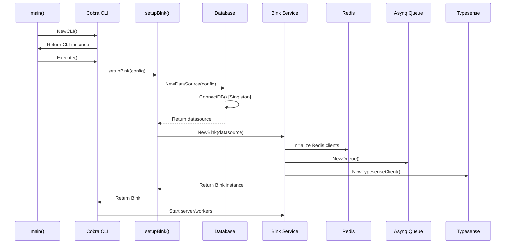
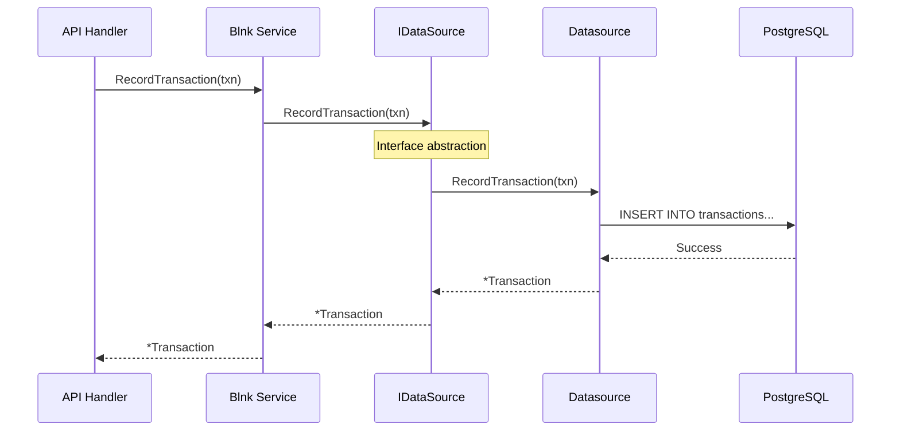
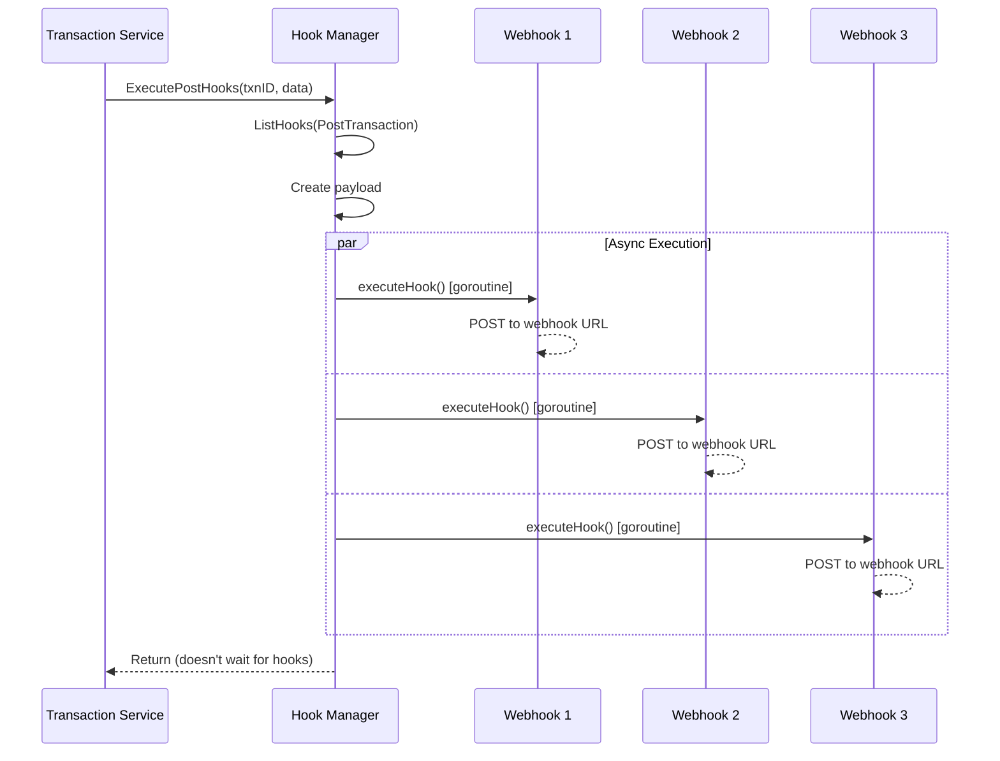
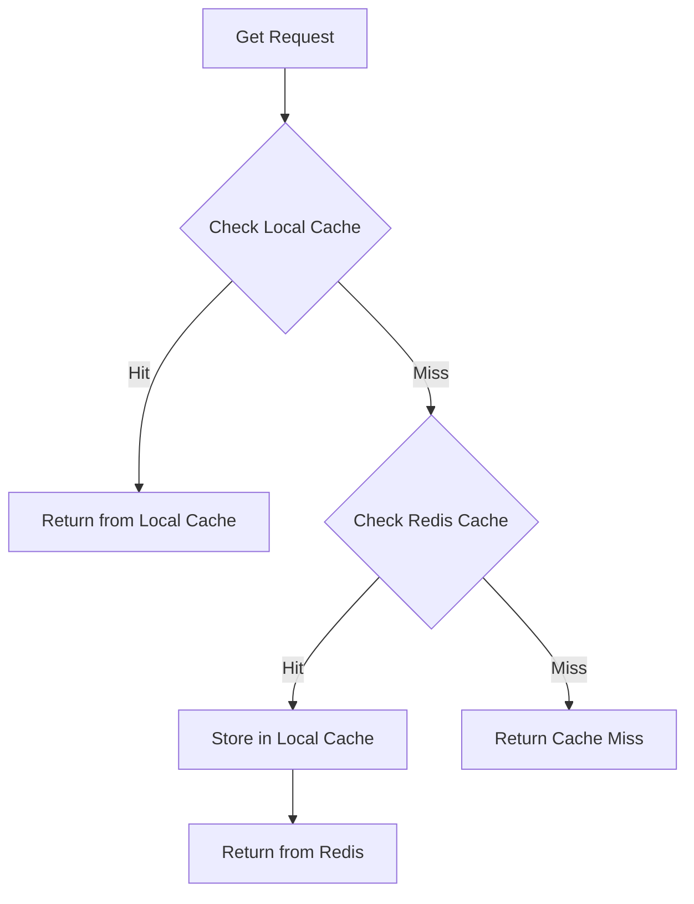
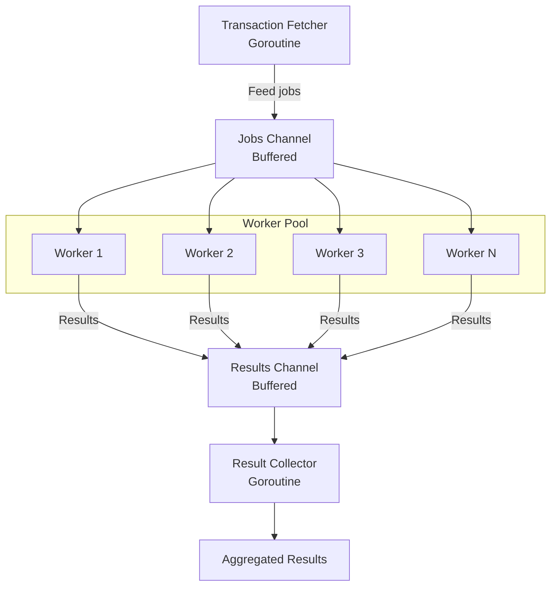
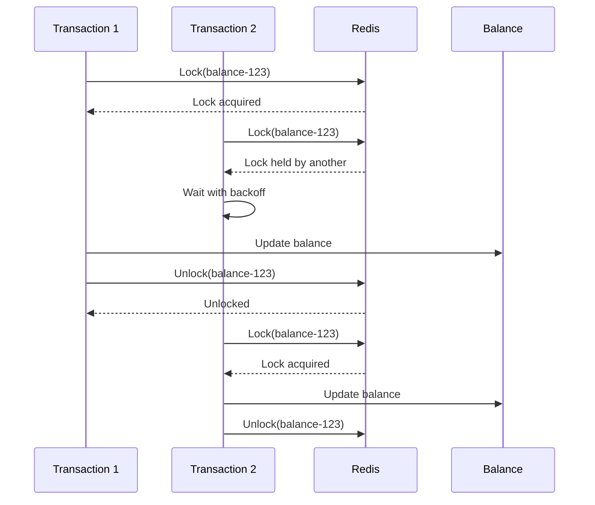
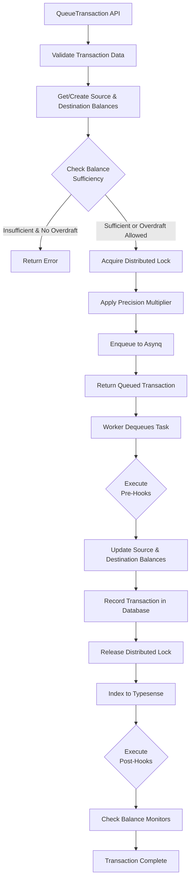
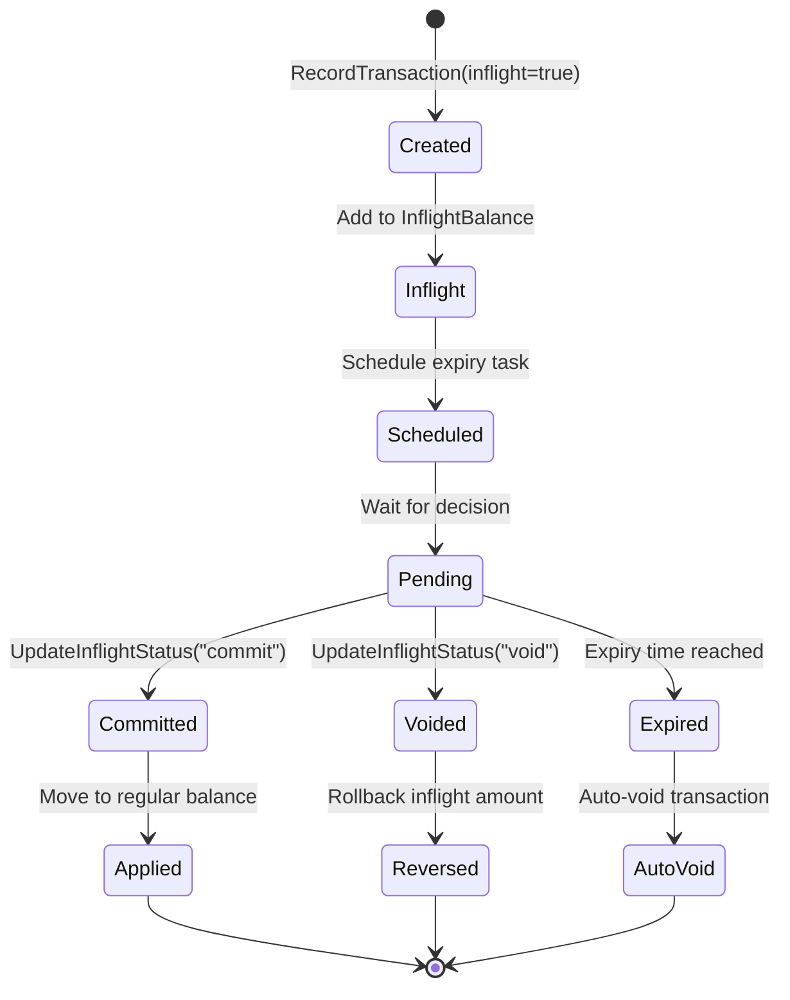
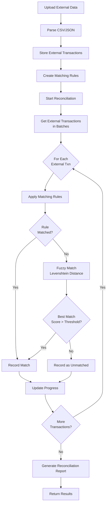

# Cara Kerja Code & Design Patterns

## Daftar Isi
- [Cara Kerja Sistem](#cara-kerja-sistem)
- [Design Patterns](#design-patterns)
- [Interface Patterns](#interface-patterns)
- [Concurrency Patterns](#concurrency-patterns)
- [Error Handling Patterns](#error-handling-patterns)
- [Business Logic Flows](#business-logic-flows)

---

## Cara Kerja Sistem

### 1. Application Startup

**File**: `/home/user/blnk/cmd/main.go`

```go
// Line 85-99: Setup Blnk instance
func setupBlnk(cfg *config.Configuration) (*blnk.Blnk, error) {
    // 1. Initialize database connection dengan singleton pattern
    db, err := database.NewDataSource(cfg)
    if err != nil {
        return &blnk.Blnk{}, fmt.Errorf("error getting datasource: %v", err)
    }

    // 2. Create Blnk instance dengan dependency injection
    newBlnk, err := blnk.NewBlnk(db)
    if err != nil {
        logrus.Error(err)
        return &blnk.Blnk{}, fmt.Errorf("error creating blnk: %v", err)
    }

    return newBlnk, nil
}
```

**Sequence Diagram**:



### 2. Database Singleton Pattern

**File**: `/home/user/blnk/database/db.go:29-76`

```go
var (
    instance *Datasource
    once     sync.Once  // Ensures initialization happens only once
)

func GetDBConnection(configuration *config.Configuration) (*Datasource, error) {
    var err error
    once.Do(func() {
        // 1. Connect to PostgreSQL
        con, errConn := ConnectDB(configuration.DataSource)
        if errConn != nil {
            err = errConn
            return
        }

        // 2. Initialize cache layer
        cacheInstance, errCache := cache.NewCache()
        if errCache != nil {
            log.Printf("Error creating cache: %v", errCache)
        }

        // 3. Create singleton instance
        instance = &Datasource{Conn: con, Cache: cacheInstance}
    })

    if err != nil {
        return nil, err
    }
    return instance, nil
}
```

**Kenapa Singleton?**
- **Single connection pool**: Menghindari exhausting database connections
- **Thread-safe**: `sync.Once` memastikan thread-safety
- **Resource efficiency**: Reuse connections across goroutines
- **Performance**: Connection pooling lebih efisien

### 3. Dependency Injection Flow

**File**: `/home/user/blnk/blnk.go:111-140`

```go
func NewBlnk(db database.IDataSource) (*Blnk, error) {
    configuration, err := config.Fetch()

    // 1. Initialize Redis clients (for queue and caching)
    redisClient, asynqClient, err := initializeRedisClients(configuration)

    // 2. Create balance tracker
    bt := NewBalanceTracker()

    // 3. Initialize task queue
    newQueue := NewQueue(configuration)

    // 4. Initialize search client
    newSearch := NewTypesenseClient(configuration.TypeSense)

    // 5. Initialize hook manager
    hookManager := hooks.NewHookManager(redisClient)

    // 6. Initialize tokenization service
    tokenizer := initializeTokenizationService(configuration)

    // 7. Create HTTP client with timeout
    httpClient := initializeHTTPClient()

    // 8. Inject all dependencies
    return &Blnk{
        datasource:  db,           // Injected database interface
        bt:          bt,
        queue:       newQueue,
        redis:       redisClient,
        asynqClient: asynqClient,
        search:      newSearch,
        tokenizer:   tokenizer,
        httpClient:  httpClient,
        Hooks:       hookManager,  // Injected hook manager interface
    }, nil
}
```

**Benefits**:
- **Testability**: Dapat inject mock dependencies
- **Flexibility**: Mudah ganti implementation
- **Loose coupling**: Services tidak depend on concrete types
- **Single Responsibility**: Each component has clear responsibility

---

## Design Patterns

### 1. Repository Pattern

**Interface Definition**: `/home/user/blnk/database/repository.go:28-142`

```go
// Composite interface pattern
type IDataSource interface {
    transaction      // Transaction operations
    ledger          // Ledger operations
    balance         // Balance operations
    identity        // Identity operations
    balanceMonitor  // Balance monitoring
    account         // Account operations
    reconciliation  // Reconciliation operations
    apikey          // API key management
}

// Sub-interface example: transaction
type transaction interface {
    RecordTransaction(ctx context.Context, txn *model.Transaction) (*model.Transaction, error)
    GetTransaction(ctx context.Context, id string) (*model.Transaction, error)
    GetTransactionByRef(ctx context.Context, reference string) (*model.Transaction, error)
    GetAllTransactions(ctx context.Context) ([]*model.Transaction, error)
    TransactionExistsByRef(ctx context.Context, reference string) (bool, error)
    UpdateTransaction(ctx context.Context, txn *model.Transaction) error
    GetBalanceTransactions(ctx context.Context, balanceID string, limit int64) ([]*model.Transaction, error)
    GetInflightTransactionsByExpiryDate(ctx context.Context, date time.Time) ([]*model.Transaction, error)
    // ... 12 more methods
}
```

**Implementation**: `/home/user/blnk/database/db.go:35-38`

```go
type Datasource struct {
    Conn  *sql.DB
    Cache cache.Cache
}
// Datasource implements all sub-interfaces, thus implements IDataSource
```

**Cara Kerja**:



**Keuntungan**:
- **Abstraction**: Service layer tidak tahu implementation details
- **Testing**: Mudah mock dengan `MockDataSource`
- **Swappable**: Dapat ganti dari PostgreSQL ke database lain
- **Clear Contract**: Interface mendefinisikan contract yang jelas

**Example Mock untuk Testing**: `/home/user/blnk/database/mocks/repo_mocks.go`

```go
type MockDataSource struct {
    mock.Mock
}

func (m *MockDataSource) RecordTransaction(ctx context.Context, txn *model.Transaction) (*model.Transaction, error) {
    args := m.Called(ctx, txn)
    return args.Get(0).(*model.Transaction), args.Error(1)
}

// Usage in tests:
mockDB := new(MockDataSource)
mockDB.On("RecordTransaction", mock.Anything, mock.Anything).Return(transaction, nil)
```

### 2. Facade Pattern

**File**: `/home/user/blnk/blnk.go:38-49`

```go
type Blnk struct {
    queue       *Queue
    search      *TypesenseClient
    redis       redis.UniversalClient
    asynqClient *asynq.Client
    datasource  database.IDataSource
    bt          *model.BalanceTracker
    tokenizer   *tokenization.TokenizationService
    httpClient  *http.Client
    Hooks       hooks.HookManager
}
```

`Blnk` struct bertindak sebagai **Facade** yang menyediakan unified interface untuk:
- Database operations (via `datasource`)
- Search operations (via `search`)
- Queue operations (via `queue`)
- Caching (via `redis`)
- Tokenization (via `tokenizer`)
- Webhooks (via `Hooks`)

**Example Method**:

```go
// File: /home/user/blnk/search.go
func (l *Blnk) Search(collection string, query *api.SearchCollectionParams) (interface{}, error) {
    return l.search.Search(collection, query)
}

// Facade menyederhanakan akses ke search client
// Client tidak perlu tahu detail tentang Typesense
```

**Benefits**:
- **Simplified API**: Satu entry point untuk semua operations
- **Encapsulation**: Hide complex subsystems
- **Decoupling**: Clients tidak depend on subsystem details

### 3. Strategy Pattern

**File**: `/home/user/blnk/transaction.go:54-75`

```go
// Strategy: Function type untuk berbagai transaction workers
type transactionWorker func(
    ctx context.Context,
    jobs <-chan *model.Transaction,
    results chan<- BatchJobResult,
    wg *sync.WaitGroup,
    amount *big.Int,
)

// Strategy: Function type untuk fetching transactions
type getTxns func(
    ctx context.Context,
    parentTransactionID string,
    batchSize int,
    offset int64,
) ([]*model.Transaction, error)
```

**Concrete Strategies**:

```go
// Strategy 1: RefundWorker
func (l *Blnk) RefundWorker(ctx context.Context, jobs <-chan *model.Transaction, results chan<- BatchJobResult, wg *sync.WaitGroup, amount *big.Int) {
    defer wg.Done()
    for job := range jobs {
        result := BatchJobResult{Txn: job}
        err := l.RefundTransaction(ctx, job.TransactionID, job.Reference)
        result.Error = err
        results <- result
    }
}

// Strategy 2: CommitWorker
func (l *Blnk) CommitWorker(ctx context.Context, jobs <-chan *model.Transaction, results chan<- BatchJobResult, wg *sync.WaitGroup, amount *big.Int) {
    defer wg.Done()
    for job := range jobs {
        result := BatchJobResult{Txn: job}
        err := l.UpdateInflightStatus(ctx, "commit", job.TransactionID)
        result.Error = err
        results <- result
    }
}

// Strategy 3: VoidWorker
func (l *Blnk) VoidWorker(ctx context.Context, jobs <-chan *model.Transaction, results chan<- BatchJobResult, wg *sync.WaitGroup, amount *big.Int) {
    defer wg.Done()
    for job := range jobs {
        result := BatchJobResult{Txn: job}
        err := l.UpdateInflightStatus(ctx, "void", job.TransactionID)
        result.Error = err
        results <- result
    }
}
```

**Usage**:

```go
// File: /home/user/blnk/transaction.go:520-610
func (l *Blnk) processBulkTransactions(
    ctx context.Context,
    parentTransactionID string,
    worker transactionWorker,  // Strategy injected here
    getTxns getTxns,
) ([]*model.Transaction, []error) {
    // ... setup channels and workers ...

    // Start workers with injected strategy
    for i := 0; i < numWorkers; i++ {
        wg.Add(1)
        go worker(ctx, jobs, results, &wg, amount)
    }

    // ... process results ...
}
```

**Benefits**:
- **Flexibility**: Dapat switch behavior at runtime
- **Open/Closed**: Mudah tambah strategy baru tanpa modify existing code
- **Code Reuse**: Core processing logic reused

### 4. Observer Pattern (Webhooks)

**File**: `/home/user/blnk/internal/hooks/manager.go:156-207`

```go
type HookManager interface {
    RegisterHook(ctx context.Context, hook *Hook) error
    ExecutePreHooks(ctx context.Context, transactionID string, data interface{}) error
    ExecutePostHooks(ctx context.Context, transactionID string, data interface{}) error
}

type redisHookManager struct {
    client    redis.UniversalClient
    keyPrefix string
}

func (m *redisHookManager) ExecutePreHooks(ctx context.Context, transactionID string, data interface{}) error {
    // 1. Get all registered pre-transaction hooks
    hooks, err := m.ListHooks(ctx, PreTransaction)
    if err != nil {
        return err
    }

    // 2. Execute all hooks asynchronously
    return m.executeHooks(ctx, hooks, PreTransaction, transactionID, data)
}

func (m *redisHookManager) executeHooks(ctx context.Context, hooks []*Hook, hookType HookType, transactionID string, data interface{}) error {
    payload := HookPayload{
        TransactionID: transactionID,
        HookType:      hookType,
        Timestamp:     time.Now(),
        Data:          dataBytes,
    }

    // Execute each hook in separate goroutine (async)
    for _, hook := range hooks {
        if !hook.Active {
            continue
        }

        go func(h *Hook) {
            hookCtx, cancel := context.WithTimeout(context.Background(), time.Duration(h.Timeout)*time.Second)
            defer cancel()

            if err := m.executeHook(hookCtx, h, payload); err != nil {
                notification.NotifyError(fmt.Errorf("hook execution failed: %w", err))
            }
        }(hook)
    }

    return nil
}
```

**Sequence Diagram**:



**Benefits**:
- **Decoupling**: Observers (webhooks) decoupled from subject (transaction)
- **Dynamic**: Dapat add/remove webhooks at runtime
- **Async**: Non-blocking execution
- **Scalable**: Multiple observers dapat listen to same event

### 5. Factory Pattern

**File**: `/home/user/blnk/blnk.go:59-100`

```go
// Factory function untuk Redis clients
func initializeRedisClients(configuration *config.Configuration) (redis.UniversalClient, *asynq.Client, error) {
    redisClient, err := redis_db.NewRedisClient(configuration.Redis.Dns)
    if err != nil {
        return nil, nil, err
    }

    asynqClient, err := redis_db.NewAsynqClient(configuration.Redis.Dns)
    if err != nil {
        return nil, nil, err
    }

    return redisClient, asynqClient, nil
}

// Factory function untuk tokenization service
func initializeTokenizationService(configuration *config.Configuration) *tokenization.TokenizationService {
    if configuration.Server.SecretKey == "" {
        return nil
    }
    return tokenization.NewTokenizationService(configuration.Server.SecretKey)
}

// Factory function untuk HTTP client
func initializeHTTPClient() *http.Client {
    return &http.Client{
        Timeout: 30 * time.Second,
        Transport: &http.Transport{
            MaxIdleConns:        100,
            MaxIdleConnsPerHost: 100,
            IdleConnTimeout:     90 * time.Second,
        },
    }
}
```

**Factory untuk Cache**: `/home/user/blnk/internal/cache/cache.go:65-78`

```go
func NewCache() (Cache, error) {
    config, err := config.Fetch()
    if err != nil {
        return nil, err
    }

    redisClient, err := redis_db.NewRedisClient(config.Redis.Dns)
    if err != nil {
        return nil, err
    }

    // Create local cache with TinyLFU
    localCache := cache.New(10000, 1000)

    return &RedisCache{
        client:     redisClient,
        localCache: localCache,
    }, nil
}
```

**Benefits**:
- **Encapsulation**: Creation logic encapsulated
- **Consistency**: Objects created consistently
- **Flexibility**: Mudah modify creation logic
- **Configuration**: Centralized configuration handling

---

## Interface Patterns

### 1. Composite Interface Pattern

**File**: `/home/user/blnk/database/repository.go:28-142`

```go
// Main interface composed of multiple smaller interfaces
type IDataSource interface {
    transaction
    ledger
    balance
    identity
    balanceMonitor
    account
    reconciliation
    apikey
}

// Each sub-interface focused on specific domain
type transaction interface {
    RecordTransaction(ctx context.Context, txn *model.Transaction) (*model.Transaction, error)
    GetTransaction(ctx context.Context, id string) (*model.Transaction, error)
    // ... more transaction methods
}

type balance interface {
    CreateBalance(ctx context.Context, balance *model.Balance) (*model.Balance, error)
    GetBalanceByID(ctx context.Context, id string, include []string) (*model.Balance, error)
    // ... more balance methods
}

// ... more sub-interfaces
```

**Keuntungan**:
- **Separation of Concerns**: Each sub-interface handles one domain
- **Interface Segregation**: Clients depend only on methods they use
- **Readability**: Easier to understand than one monolithic interface
- **Maintainability**: Easier to modify specific domain operations

### 2. Interface-Based Dependency Injection

**Service depends on interface, not concrete type**:

```go
// Blnk service depends on IDataSource interface
type Blnk struct {
    datasource  database.IDataSource  // Interface, not *Datasource
    // ...
}

// Blnk depends on HookManager interface
type Blnk struct {
    Hooks hooks.HookManager  // Interface, not *redisHookManager
    // ...
}
```

**Testing becomes easy**:

```go
// In tests
mockDB := new(MockDataSource)
mockDB.On("GetTransaction", mock.Anything, "txn-123").Return(expectedTxn, nil)

blnk := &Blnk{
    datasource: mockDB,  // Inject mock
}
```

### 3. Cache Interface Pattern

**File**: `/home/user/blnk/internal/cache/cache.go:30-54`

```go
type Cache interface {
    Set(ctx context.Context, key string, value interface{}, ttl time.Duration) error
    Get(ctx context.Context, key string, data interface{}) error
    Delete(ctx context.Context, key string) error
}

type RedisCache struct {
    client     redis.UniversalClient
    localCache *cache.Cache  // TinyLFU cache
}

func (c *RedisCache) Get(ctx context.Context, key string, data interface{}) error {
    // 1. Try local cache first
    if val, found := c.localCache.Get(key); found {
        return json.Unmarshal(val.([]byte), data)
    }

    // 2. Try Redis if not in local cache
    val, err := c.client.Get(ctx, key).Result()
    if err != nil {
        return err
    }

    // 3. Store in local cache for future requests
    c.localCache.Set(key, []byte(val), cache.DefaultExpiration)

    return json.Unmarshal([]byte(val), data)
}
```

**Multi-layer caching strategy**:



---

## Concurrency Patterns

### 1. Worker Pool Pattern

**File**: `/home/user/blnk/transaction.go:520-625`

```go
func (l *Blnk) processBulkTransactions(
    ctx context.Context,
    parentTransactionID string,
    worker transactionWorker,
    getTxns getTxns,
) ([]*model.Transaction, []error) {

    config, _ := config.Fetch()
    batchSize := config.Transaction.BatchSize
    numWorkers := config.Transaction.MaxWorkers  // e.g., 10 workers
    maxQueueSize := config.Transaction.MaxQueueSize  // e.g., 1000

    var mu sync.Mutex
    var wg sync.WaitGroup

    // Create buffered channels
    jobs := make(chan *model.Transaction, maxQueueSize)
    results := make(chan BatchJobResult, maxQueueSize)
    errChan := make(chan error, 1)

    var allTxns []*model.Transaction
    var allErrors []error

    // Start worker pool
    for i := 0; i < numWorkers; i++ {
        wg.Add(1)
        go worker(ctx, jobs, results, &wg, amount)
    }

    // Goroutine to fetch and feed transactions
    go fetchTransactions(ctx, parentTransactionID, batchSize, getTxns, jobs, errChan)

    // Goroutine to collect results
    done := make(chan struct{})
    go processResults(results, &mu, &allTxns, &allErrors, done)

    // Wait for all workers to complete
    wg.Wait()
    close(results)
    <-done  // Wait for result processing to complete

    return allTxns, allErrors
}
```

**Flow Diagram**:



**Keuntungan**:
- **Concurrency**: Multiple transactions processed simultaneously
- **Bounded**: Channel buffer prevents memory exhaustion
- **Synchronization**: WaitGroup ensures all workers complete
- **Efficient**: Workers reused, avoiding goroutine creation overhead

### 2. Distributed Locking Pattern

**File**: `/home/user/blnk/internal/lock/lock.go:28-125`

```go
type Locker struct {
    client redis.UniversalClient
    key    string
    value  string  // Unique identifier for this lock holder
}

func (l *Locker) Lock(ctx context.Context, timeout time.Duration) error {
    // SetNX: Set if Not eXists (atomic operation)
    success, err := l.client.SetNX(ctx, l.key, l.value, timeout).Result()
    if err != nil {
        return err
    }
    if !success {
        return fmt.Errorf("lock for key %s is already held", l.key)
    }
    return nil
}

func (l *Locker) Unlock(ctx context.Context) error {
    // Lua script ensures atomicity:
    // 1. Check if the lock value matches (ensuring we own the lock)
    // 2. Delete the lock if it matches
    script := `
        if redis.call('get', KEYS[1]) == ARGV[1] then
            return redis.call('del', KEYS[1])
        else
            return 0
        end
    `
    result, err := l.client.Eval(ctx, script, []string{l.key}, l.value).Result()
    if err != nil {
        return err
    }
    if result == int64(0) {
        return fmt.Errorf("unlock failed, lock not owned")
    }
    return nil
}

func (l *Locker) WaitLock(ctx context.Context, lockTimeout, waitTimeout time.Duration) error {
    deadline := time.Now().Add(waitTimeout)

    for time.Now().Before(deadline) {
        err := l.Lock(ctx, lockTimeout)
        if err == nil {
            return nil  // Lock acquired
        }

        // Exponential backoff to reduce contention
        backoff := time.Duration(rand.Intn(100)) * time.Millisecond
        time.Sleep(backoff)
    }

    return fmt.Errorf("failed to acquire lock within timeout")
}
```

**Usage in Transaction Processing**: `/home/user/blnk/transaction.go:177-194`

```go
func (l *Blnk) acquireLock(ctx context.Context, transaction *model.Transaction) (*redlock.Locker, error) {
    ctx, span := tracer.Start(ctx, "Acquiring Lock")
    defer span.End()

    config, err := config.Fetch()
    if err != nil {
        return nil, err
    }

    // Create locker for source balance
    locker := redlock.NewLocker(
        l.redis,
        transaction.Source,  // Lock key is the source balance ID
        model.GenerateUUIDWithSuffix("loc"),  // Unique lock value
    )

    // Acquire lock with configured duration
    err = locker.Lock(ctx, config.Transaction.LockDuration)
    if err != nil {
        span.RecordError(err)
        return nil, err
    }

    span.AddEvent("Lock acquired")
    return locker, nil
}
```

**Lock Lifecycle**:



**Benefits**:
- **Race Condition Prevention**: Only one transaction can update balance at a time
- **Data Consistency**: Prevents inconsistent balance state
- **Distributed**: Works across multiple server instances
- **Automatic Expiry**: Lock expires if holder crashes
- **Fair**: Exponential backoff prevents starvation

### 3. Channel-Based Async Execution

**File**: `/home/user/blnk/internal/hooks/manager.go:191-205`

```go
for _, hook := range hooks {
    if !hook.Active {
        continue
    }

    // Launch goroutine for each webhook (non-blocking)
    go func(h *Hook) {
        // Create timeout context
        hookCtx, cancel := context.WithTimeout(
            context.Background(),
            time.Duration(h.Timeout)*time.Second,
        )
        defer cancel()

        // Execute webhook
        if err := m.executeHook(hookCtx, h, payload); err != nil {
            notification.NotifyError(
                fmt.Errorf("hook execution failed for hook %s: %w", h.ID, err),
            )
        }
    }(hook)
}
```

**Pattern**: Fire-and-forget goroutines with timeout

**File**: `/home/user/blnk/balance.go:74-82`

```go
// Async webhook notification when balance monitor triggered
go func(monitor model.BalanceMonitor) {
    err := l.SendWebhook(NewWebhook{
        Event:   "balance.monitor",
        Payload: monitor,
    })
    if err != nil {
        notification.NotifyError(err)
    }
}(monitor)
```

**Benefits**:
- **Non-blocking**: Main flow continues without waiting
- **Timeout**: Prevents hanging on slow webhooks
- **Error Handling**: Errors logged but don't affect main flow
- **Scalability**: Can handle many webhooks concurrently

---

## Error Handling Patterns

### 1. Custom Error Types dengan Error Codes

**File**: `/home/user/blnk/internal/apierror/apierror.go:26-81`

```go
type ErrorCode string

const (
    ErrNotFound       ErrorCode = "NOT_FOUND"
    ErrConflict       ErrorCode = "CONFLICT"
    ErrBadRequest     ErrorCode = "BAD_REQUEST"
    ErrInvalidInput   ErrorCode = "INVALID_INPUT"
    ErrInternalServer ErrorCode = "INTERNAL_SERVER_ERROR"
    ErrUnauthorized   ErrorCode = "UNAUTHORIZED"
    ErrForbidden      ErrorCode = "FORBIDDEN"
)

type APIError struct {
    Code    ErrorCode   `json:"code"`
    Message string      `json:"message"`
    Details interface{} `json:"details,omitempty"`
}

func (e APIError) Error() string {
    return fmt.Sprintf("%s: %s", e.Code, e.Message)
}

func NewAPIError(code ErrorCode, message string, details interface{}) APIError {
    logrus.Error(details)
    return APIError{
        Code:    code,
        Message: message,
        Details: details,
    }
}

// Map error to HTTP status code
func MapErrorToHTTPStatus(err error) int {
    if apiErr, ok := err.(APIError); ok {
        switch apiErr.Code {
        case ErrNotFound:
            return http.StatusNotFound
        case ErrConflict:
            return http.StatusConflict
        case ErrInvalidInput, ErrBadRequest:
            return http.StatusBadRequest
        case ErrUnauthorized:
            return http.StatusUnauthorized
        case ErrForbidden:
            return http.StatusForbidden
        case ErrInternalServer:
            return http.StatusInternalServerError
        }
    }
    return http.StatusInternalServerError
}
```

**Usage**: `/home/user/blnk/database/transaction.go:40-78`

```go
func (d Datasource) RecordTransaction(ctx context.Context, txn *model.Transaction) (*model.Transaction, error) {
    ctx, span := otel.Tracer("transaction.database").Start(ctx, "RecordTransaction")
    defer span.End()

    metaDataJSON, err := json.Marshal(txn.MetaData)
    if err != nil {
        span.RecordError(err)
        return nil, apierror.NewAPIError(
            apierror.ErrInternalServer,
            "Failed to marshal metadata",
            err,
        )
    }

    _, err = d.Conn.ExecContext(ctx, query, args...)
    if err != nil {
        span.RecordError(err)
        return nil, apierror.NewAPIError(
            apierror.ErrInternalServer,
            "Failed to record transaction",
            err,
        )
    }

    return txn, nil
}
```

**Benefits**:
- **Structured**: Consistent error format across application
- **Client-Friendly**: Error codes easier for clients to handle
- **Logging**: Automatic logging of error details
- **HTTP Mapping**: Easy conversion to HTTP status codes

### 2. Error Wrapping dengan Context

**File**: `/home/user/blnk/transaction.go:100-165`

```go
func (l *Blnk) getSourceAndDestination(ctx context.Context, transaction *model.Transaction) (source *model.Balance, destination *model.Balance, err error) {
    ctx, span := tracer.Start(ctx, "GetSourceAndDestination")
    defer span.End()

    // Error propagation with context
    cfg, err := config.Fetch()
    if err != nil {
        span.RecordError(err)
        logrus.Errorf("failed to fetch config: %v", err)
        return nil, nil, err  // Propagate error
    }

    // Handle indicator pattern (@username)
    if strings.HasPrefix(transaction.Source, "@") {
        sourceBalance, err = l.getOrCreateBalanceByIndicator(
            ctx,
            transaction.Source,
            transaction.Currency,
        )
        if err != nil {
            span.RecordError(err)
            logrus.Errorf("source error %v", err)
            return nil, nil, fmt.Errorf("failed to get source balance: %w", err)  // Wrap error
        }
        transaction.Source = sourceBalance.BalanceID
        span.SetAttributes(attribute.String("source.balance_id", sourceBalance.BalanceID))
    } else {
        sourceBalance, err = l.GetBalance(ctx, transaction.Source)
        if err != nil {
            span.RecordError(err)
            return nil, nil, fmt.Errorf("failed to get source balance: %w", err)
        }
    }

    // Similar for destination...

    span.AddEvent("Retrieved source and destination balances")
    return sourceBalance, destinationBalance, nil
}
```

**Error Chain**:
```
Original error: "connection refused"
  Wrapped: "failed to execute query: connection refused"
    Wrapped: "failed to get source balance: failed to execute query: connection refused"
```

### 3. Graceful Error Notifications

**File**: `/home/user/blnk/internal/notification/notification.go:102-126`

```go
// NotifyError sends error asynchronously to notification channels
func NotifyError(systemError error) {
    go func(systemError error) {  // Non-blocking
        logrus.Error(systemError)

        conf, err := config.Fetch()
        if err != nil {
            log.Println(err)
            return
        }

        // Send to Slack if configured
        if conf.Notification.Slack.WebhookUrl != "" {
            SlackNotification(systemError)
        }

        // Can add more notification channels here
        // e.g., PagerDuty, email, etc.
    }(systemError)
}

func SlackNotification(err error) {
    conf, _ := config.Fetch()

    payload := fmt.Sprintf(`{
        "blocks": [
            {
                "type": "header",
                "text": {"type": "plain_text", "text": "Error From Blnk 🐞"}
            },
            {
                "type": "section",
                "text": {"type": "mrkdwn", "text": "*Error:*\n%s"}
            },
            {
                "type": "section",
                "text": {"type": "mrkdwn", "text": "*Time:*\n%s"}
            }
        ]
    }`, err.Error(), time.Now().Format(time.RFC822))

    http.Post(conf.Notification.Slack.WebhookUrl, "application/json", bytes.NewBuffer([]byte(payload)))
}
```

---

## Business Logic Flows

### 1. Transaction Processing Flow

**File**: `/home/user/blnk/transaction.go`



**Code Flow**:

```go
// 1. API Handler: Queue transaction
func (a *Api) QueueTransaction(c *gin.Context) {
    var newTransaction model.Transaction
    c.ShouldBindJSON(&newTransaction)

    // 2. Service: Validate and queue
    txn, err := a.blnk.QueueTransaction(c.Request.Context(), &newTransaction)
    if err != nil {
        c.JSON(apierror.MapErrorToHTTPStatus(err), gin.H{"error": err.Error()})
        return
    }

    c.JSON(http.StatusCreated, txn)
}

// 3. Service: QueueTransaction
func (l *Blnk) QueueTransaction(ctx context.Context, transaction *model.Transaction) (*model.Transaction, error) {
    // Get or create balances
    source, destination, err := l.getSourceAndDestination(ctx, transaction)

    // Check balance sufficiency
    if !transaction.AllowOverdraft {
        if source.Balance.Cmp(preciseAmount) < 0 {
            return nil, apierror.NewAPIError(apierror.ErrInsufficientFunds, "Insufficient balance", nil)
        }
    }

    // Enqueue to worker
    err = l.queue.queueTransaction(ctx, transaction, source, destination)

    return transaction, nil
}

// 4. Worker: Process transaction
func (l *Blnk) DequeueTransaction(ctx context.Context, task *asynq.Task) error {
    var queuedTxn QueuedTransaction
    json.Unmarshal(task.Payload(), &queuedTxn)

    // Acquire lock
    locker, err := l.acquireLock(ctx, queuedTxn.Transaction)
    defer locker.Unlock(ctx)

    // Execute pre-hooks
    l.Hooks.ExecutePreHooks(ctx, queuedTxn.Transaction.TransactionID, queuedTxn.Transaction)

    // Update balances
    err = l.updateBalances(ctx, queuedTxn.Transaction, queuedTxn.Source, queuedTxn.Destination)

    // Record transaction
    recordedTxn, err := l.datasource.RecordTransaction(ctx, queuedTxn.Transaction)

    // Index to search
    l.search.IndexTransaction(recordedTxn)

    // Execute post-hooks
    l.Hooks.ExecutePostHooks(ctx, recordedTxn.TransactionID, recordedTxn)

    // Check balance monitors
    l.checkBalanceMonitors(ctx, updatedSource)

    return nil
}
```

### 2. Inflight Transaction Flow

**Purpose**: Untuk transaksi yang butuh approval sebelum di-commit (e.g., card authorization)



**Code**: `/home/user/blnk/transaction.go:850-950`

```go
// 1. Create inflight transaction
func (l *Blnk) RecordTransaction(ctx context.Context, txn *model.Transaction) (*model.Transaction, error) {
    if txn.Inflight {
        // Add to inflight balance instead of regular balance
        destination.InflightCreditBalance.Add(destination.InflightCreditBalance, txn.PreciseAmount)
        source.InflightDebitBalance.Add(source.InflightDebitBalance, txn.PreciseAmount)

        // Schedule expiry task
        if !txn.InflightExpiryDate.IsZero() {
            l.queue.queueInflightExpiry(ctx, txn)
        }
    }

    return l.datasource.RecordTransaction(ctx, txn)
}

// 2. Commit inflight transaction
func (l *Blnk) UpdateInflightStatus(ctx context.Context, status, txnID string) error {
    txn, err := l.datasource.GetTransaction(ctx, txnID)

    if status == "commit" {
        // Move from inflight to regular balance
        destination.Balance.Add(destination.Balance, txn.PreciseAmount)
        destination.CreditBalance.Add(destination.CreditBalance, txn.PreciseAmount)
        destination.InflightCreditBalance.Sub(destination.InflightCreditBalance, txn.PreciseAmount)

        source.Balance.Sub(source.Balance, txn.PreciseAmount)
        source.DebitBalance.Add(source.DebitBalance, txn.PreciseAmount)
        source.InflightDebitBalance.Sub(source.InflightDebitBalance, txn.PreciseAmount)

        txn.Status = "COMMIT"
    } else if status == "void" {
        // Rollback inflight amounts
        destination.InflightCreditBalance.Sub(destination.InflightCreditBalance, txn.PreciseAmount)
        source.InflightDebitBalance.Sub(source.InflightDebitBalance, txn.PreciseAmount)

        txn.Status = "VOID"
    }

    // Update database
    l.datasource.UpdateTransaction(ctx, txn)
    l.datasource.UpdateBalance(ctx, source)
    l.datasource.UpdateBalance(ctx, destination)

    return nil
}
```

### 3. Reconciliation Flow

**Purpose**: Mencocokkan transaksi internal dengan data eksternal (bank statements)



**Code**: `/home/user/blnk/reconciliation.go`

```go
// 1. Upload external data
func (l *Blnk) UploadExternalData(ctx context.Context, upload *model.UploadExternalData) error {
    // Parse CSV or JSON file
    externalTxns, err := parseExternalFile(upload.Source)

    // Store in database
    for _, extTxn := range externalTxns {
        l.datasource.CreateExternalTransaction(ctx, extTxn)
    }

    return nil
}

// 2. Create matching rule
func (l *Blnk) CreateMatchingRule(ctx context.Context, rule *model.MatchingRule) error {
    // Rule examples:
    // - Match by reference: external.reference == internal.reference
    // - Match by amount and date: external.amount == internal.amount AND date within 24h
    // - Match by description: Levenshtein distance of descriptions < threshold

    return l.datasource.CreateMatchingRule(ctx, rule)
}

// 3. Start reconciliation
func (l *Blnk) StartReconciliation(ctx context.Context, reconID string) (*model.Reconciliation, error) {
    recon, _ := l.datasource.GetReconciliation(ctx, reconID)
    rules, _ := l.datasource.GetMatchingRules(ctx, reconID)

    batchSize := 100
    offset := 0

    for {
        // Get batch of external transactions
        externalTxns, _ := l.datasource.GetExternalTransactions(ctx, reconID, batchSize, offset)
        if len(externalTxns) == 0 {
            break
        }

        for _, extTxn := range externalTxns {
            // Try rule-based matching
            match, found := l.applyMatchingRules(ctx, extTxn, rules)

            if !found {
                // Try fuzzy matching with Levenshtein distance
                match, found = l.fuzzyMatch(ctx, extTxn)
            }

            if found {
                l.datasource.RecordMatch(ctx, reconID, extTxn.ID, match.TransactionID)
                recon.MatchedCount++
            } else {
                recon.UnmatchedCount++
            }

            // Update progress
            recon.ProgressData.ProcessedCount++
            if recon.ProgressData.ProcessedCount%100 == 0 {
                l.datasource.UpdateReconciliation(ctx, recon)
            }
        }

        offset += batchSize
    }

    // Calculate match percentage
    total := recon.MatchedCount + recon.UnmatchedCount
    recon.MatchPercentage = float64(recon.MatchedCount) / float64(total) * 100
    recon.Status = "completed"

    l.datasource.UpdateReconciliation(ctx, recon)

    return recon, nil
}

// Fuzzy matching dengan Levenshtein distance
func (l *Blnk) fuzzyMatch(ctx context.Context, extTxn *model.ExternalTransaction) (*model.Transaction, bool) {
    // Get candidate transactions (within date range, similar amount)
    candidates, _ := l.datasource.GetTransactionsByDateAndAmount(
        ctx,
        extTxn.Date.Add(-24*time.Hour),
        extTxn.Date.Add(24*time.Hour),
        extTxn.Amount*0.99,  // 1% tolerance
        extTxn.Amount*1.01,
    )

    bestMatch := (*model.Transaction)(nil)
    bestScore := 999999
    threshold := 5  // Max Levenshtein distance

    for _, candidate := range candidates {
        // Calculate Levenshtein distance between descriptions
        score := levenshtein(extTxn.Description, candidate.Reference)

        if score < bestScore {
            bestScore = score
            bestMatch = candidate
        }
    }

    if bestScore <= threshold {
        return bestMatch, true
    }

    return nil, false
}
```

### 4. Balance Monitoring Flow

**Purpose**: Alert ketika balance memenuhi kondisi tertentu (e.g., balance < 1000)

```go
// 1. Create balance monitor
func (l *Blnk) CreateBalanceMonitor(ctx context.Context, monitor *model.BalanceMonitor) error {
    // Monitor structure:
    // {
    //   "balance_id": "bal-123",
    //   "condition": {
    //     "field": "balance",
    //     "operator": "less_than",
    //     "value": 1000
    //   },
    //   "webhook_url": "https://api.example.com/webhooks/low-balance"
    // }

    return l.datasource.CreateBalanceMonitor(ctx, monitor)
}

// 2. Check monitors after balance update
func (l *Blnk) checkBalanceMonitors(ctx context.Context, updatedBalance *model.Balance) {
    _, span := balanceTracer.Start(ctx, "CheckBalanceMonitors")
    defer span.End()

    // Get all monitors for this balance
    monitors, err := l.datasource.GetBalanceMonitorsByBalanceID(ctx, updatedBalance.BalanceID)
    if err != nil {
        return
    }

    for _, monitor := range monitors {
        // Evaluate condition
        triggered := l.evaluateCondition(updatedBalance, monitor.Condition)

        if triggered {
            // Send webhook notification asynchronously
            go func(m model.BalanceMonitor) {
                err := l.SendWebhook(NewWebhook{
                    Event: "balance.monitor",
                    Payload: map[string]interface{}{
                        "monitor_id": m.MonitorID,
                        "balance_id": m.BalanceID,
                        "balance":    updatedBalance.Balance.String(),
                        "condition":  m.Condition,
                        "triggered_at": time.Now(),
                    },
                })
                if err != nil {
                    notification.NotifyError(err)
                }
            }(monitor)
        }
    }
}

func (l *Blnk) evaluateCondition(balance *model.Balance, condition model.Condition) bool {
    var fieldValue *big.Int

    switch condition.Field {
    case "balance":
        fieldValue = balance.Balance
    case "credit_balance":
        fieldValue = balance.CreditBalance
    case "debit_balance":
        fieldValue = balance.DebitBalance
    case "inflight_balance":
        fieldValue = balance.InflightBalance
    }

    comparisonValue := new(big.Int).SetInt64(int64(condition.Value))

    switch condition.Operator {
    case "less_than":
        return fieldValue.Cmp(comparisonValue) < 0
    case "greater_than":
        return fieldValue.Cmp(comparisonValue) > 0
    case "equals":
        return fieldValue.Cmp(comparisonValue) == 0
    case "less_than_or_equal":
        return fieldValue.Cmp(comparisonValue) <= 0
    case "greater_than_or_equal":
        return fieldValue.Cmp(comparisonValue) >= 0
    }

    return false
}
```

---

## Key Takeaways

### 1. **Arsitektur Berlapis (Layered Architecture)**
- **API Layer**: HTTP handlers, routing, middleware
- **Service Layer**: Business logic, orchestration
- **Repository Layer**: Data access abstraction
- **Infrastructure**: Cross-cutting concerns (cache, queue, search)

### 2. **Interface-Driven Design**
- Semua major components defined sebagai interfaces
- Dependency injection untuk loose coupling
- Easy mocking untuk testing
- Swappable implementations

### 3. **Concurrency-First**
- Worker pools untuk parallel processing
- Channels untuk communication
- Distributed locking untuk consistency
- Async execution untuk non-critical operations

### 4. **Precision & Consistency**
- `big.Int` untuk arbitrary precision
- Distributed locking untuk balance updates
- ACID transactions di database
- Transaction hashing untuk integrity

### 5. **Observability**
- OpenTelemetry untuk distributed tracing
- Structured logging dengan logrus
- Error notifications ke Slack
- Health check endpoints

### 6. **Scalability**
- Stateless API servers
- Async task processing
- Horizontal scaling ready
- Multi-layer caching

### 7. **Security**
- API key authentication
- Scope-based authorization
- PII tokenization dengan encryption
- Input validation
- SQL injection prevention

---

## Kesimpulan

Blnk Finance codebase mendemonstrasikan **best practices** dalam Go development:

1. **Clean Architecture**: Separation of concerns yang jelas
2. **SOLID Principles**: Especially Interface Segregation dan Dependency Inversion
3. **Design Patterns**: Repository, Facade, Strategy, Observer, Factory, Singleton
4. **Concurrency**: Efficient use of goroutines dan channels
5. **Error Handling**: Structured errors dengan proper propagation
6. **Testing**: Interface-based design memudahkan testing
7. **Observability**: Comprehensive tracing dan logging
8. **Performance**: Multi-layer caching, connection pooling, worker pools
9. **Reliability**: Distributed locking, retry mechanisms, task queues
10. **Maintainability**: Clean code, clear structure, good documentation

Code ini production-ready dan siap untuk scale.
